# secured-hospital-app

  <h2>Pom file</h2>
  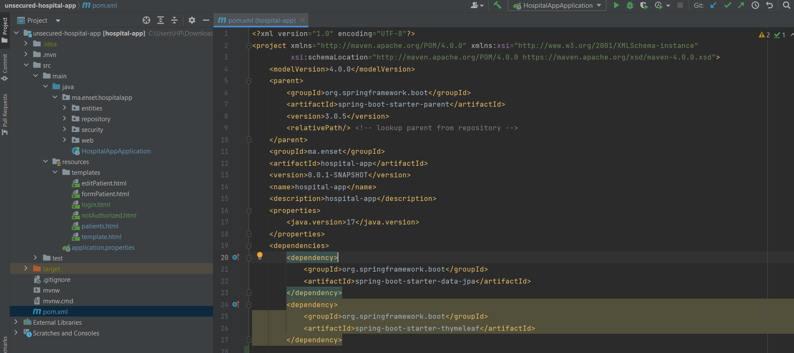
  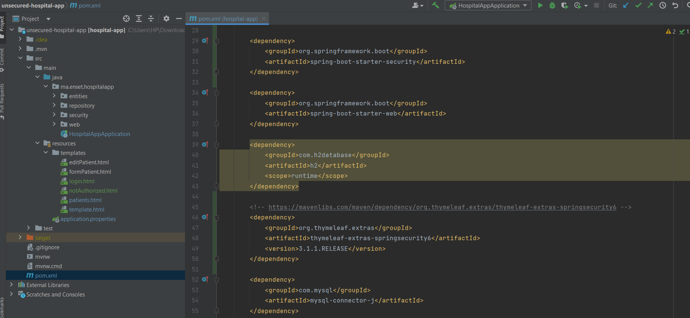
  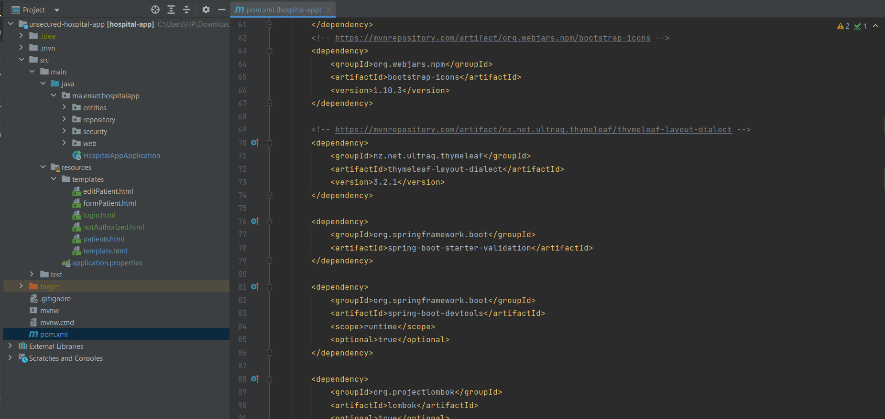
  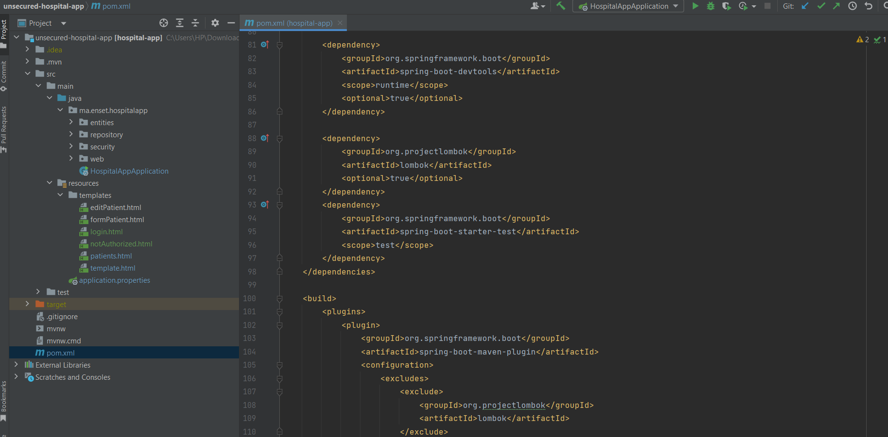
  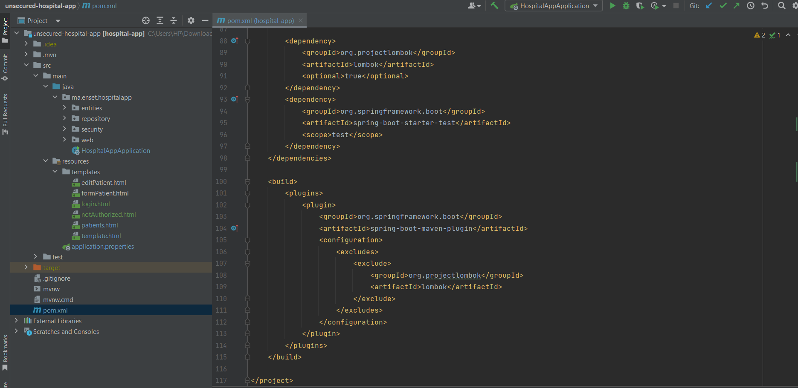
  <h2>Application.properties</h2>
  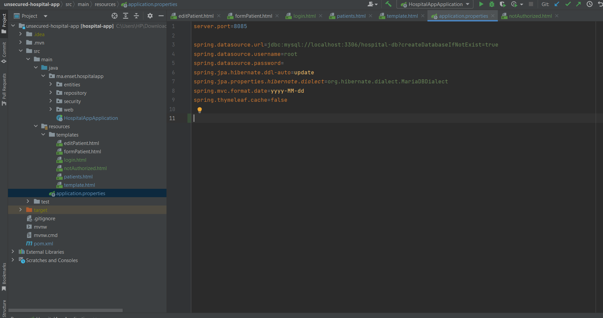
  <h2>Templates</h2>
  <h4>Template</h4>
  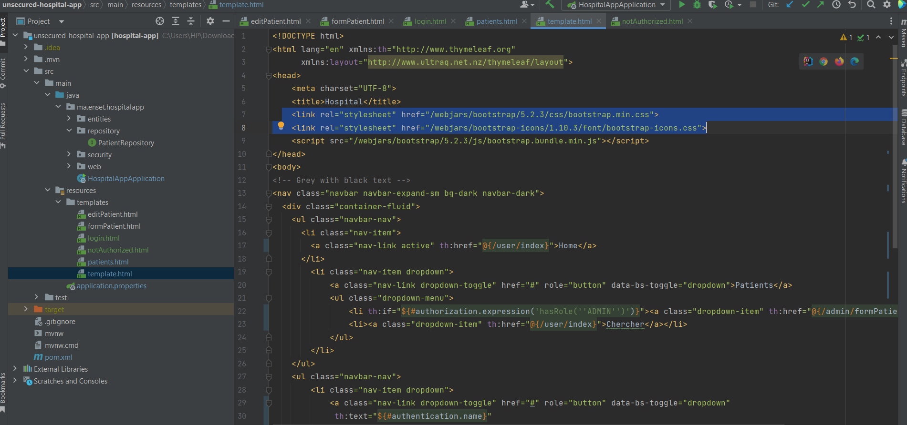
  <h4>Template2</h4>
  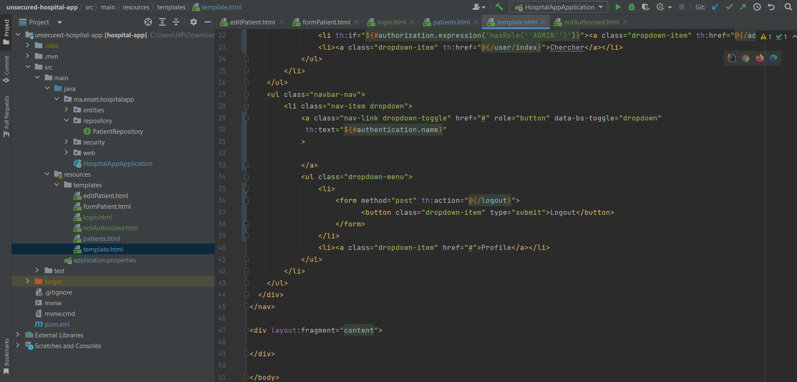
  <h4>Liste des patients</h4>
  
  
  
  <h4>Not Authorized</h4>
  
  <h4>Login</h4>
  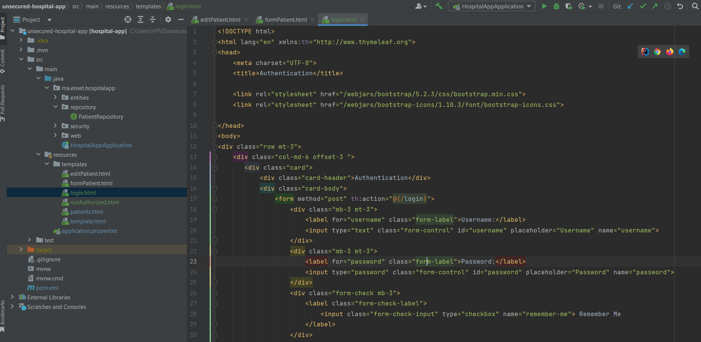
  <h4>Formpatient</h4>
  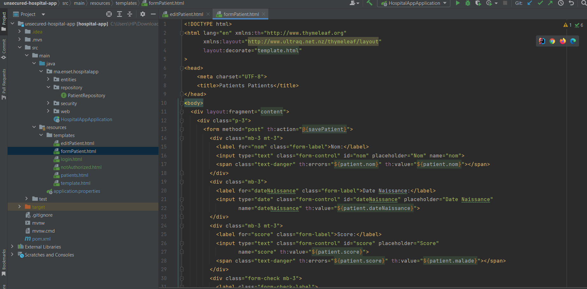
  <h4>Editpatient</h4>
  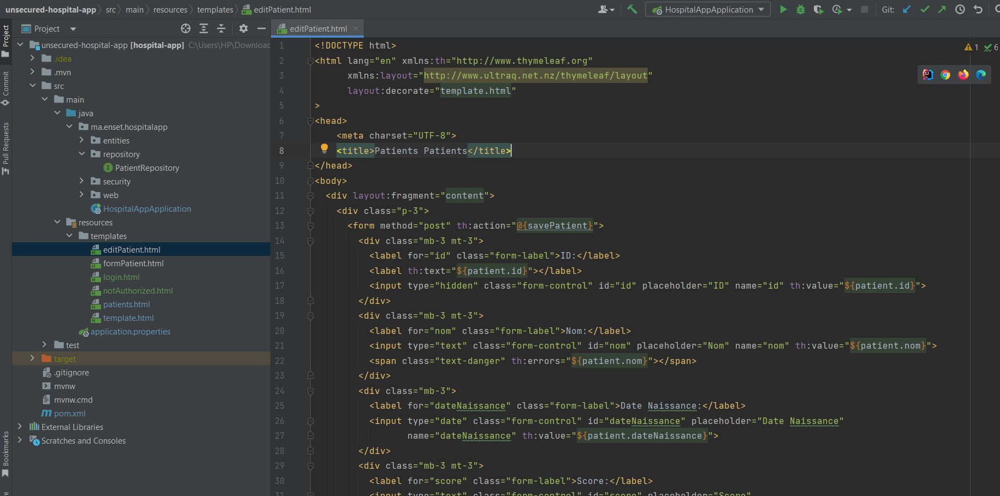
  <h2>HospitalAppApplication</h2>
  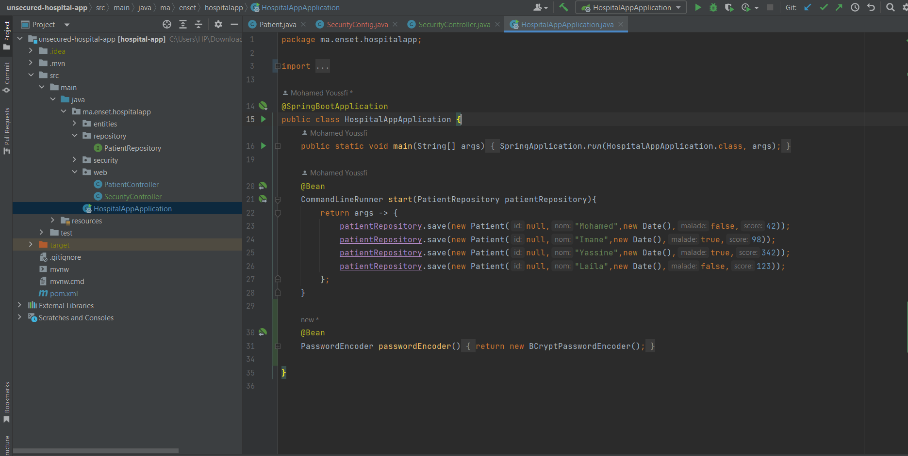
  <h2>Web Controller</h2>
  <h4>PatientController</h4>
  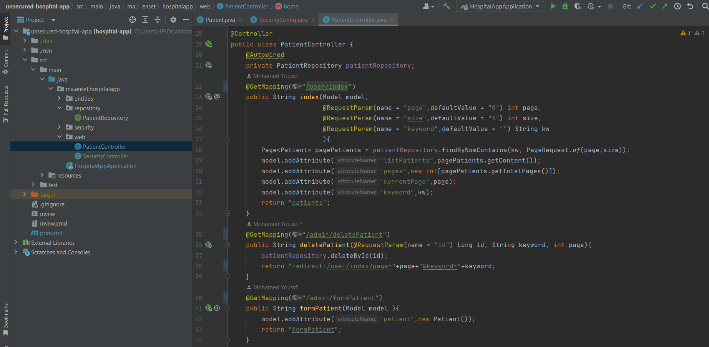
  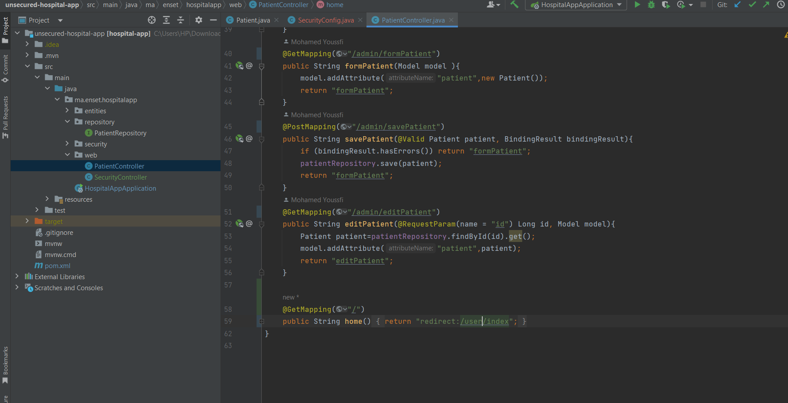
  
  

